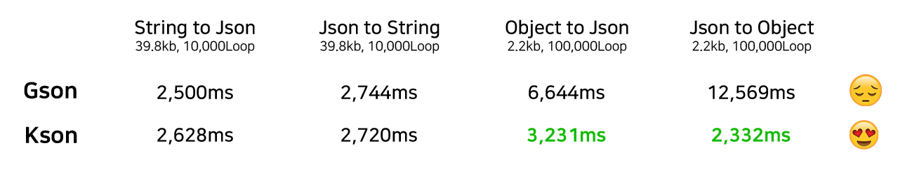
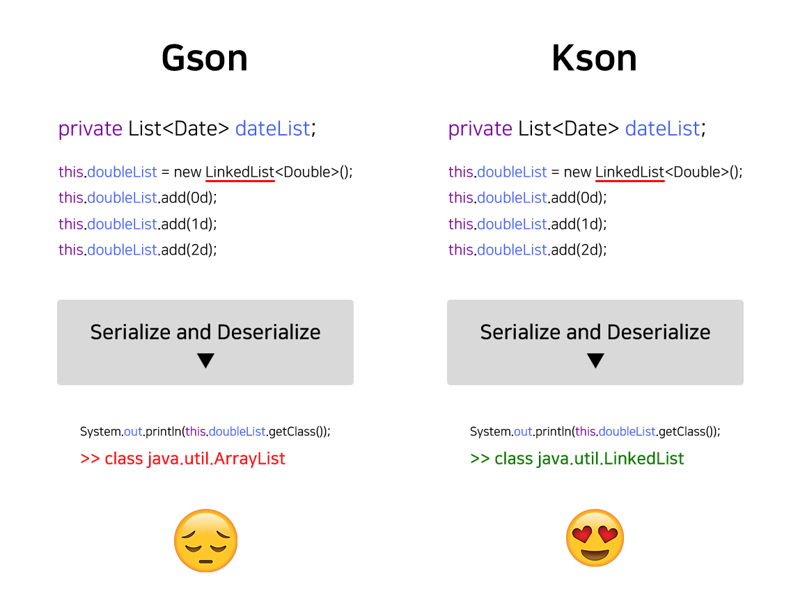
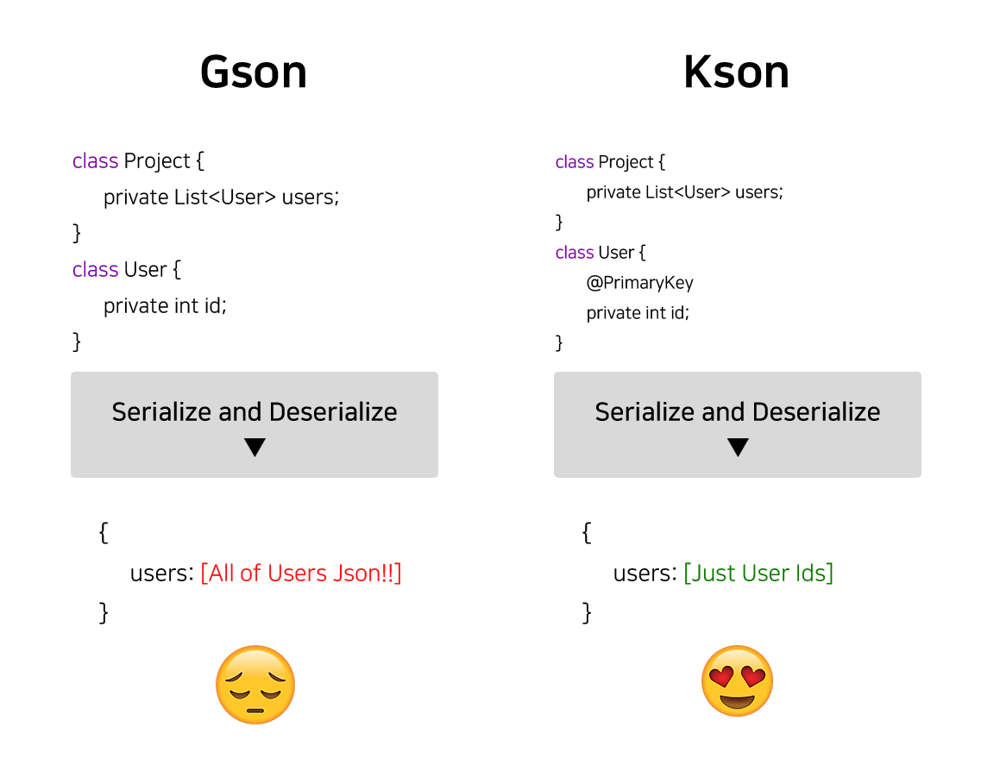

<p align="right">
  <b>Languages</b><br>
  <a href="README_KR.md">Korean</a> |
  <a href="README.md">English</a>
</p>

<h1 align="center" style="max-width: 100%;">
  <a href="https://github.com/realtimetech-solution/kson"></a>
</h1>
<p align="center" style="max-width: 100%;">
  <a href="#"></a>
  <a href="#"></a>
  <a href="#"></a>
  <a href="https://github.com/realtimetech-solution/kson/issues"></a>
  <a href="https://github.com/realtimetech-solution/kson/commits/master"></a>
  <br>
  <a href="https://github.com/realtimetech-solution/kson/releases"></a>
  <a href="https://github.com/realtimetech-solution/kson/releases"></a>
</p>

# Kson
> This project is a library developed by REALTIMETECH Solution Division 2.

## 1. What is Kson?

### 1.1. Key Function

>
>- #### 190% Faster then Gson
>      Experience faster Object Serialize, Deserialize, and Json Parse!
>      
>
>- #### Supported extended Number, Key Types (Optional)
>      Specify ambiguous numeric data, and use Array and Dict as Dict's Key!
>
>- #### Automatically serialize Interface / Abstract Class field (Optional)
>      Don't worry about the fields in interface, Abstract Class! (List or Map)
>      
>
>- #### Make Primary Object (Optional)
>      Manage Objects included in multiple objects as one by specifying Primary Key!
>      
>


### 1.2. Data Example

Kson is a new data format compatible with the Json standards. It solves the ambiguous number type problem of Json and supports the following data types.

```
{
   "longValueLower"    : 100l,
   "floatValueLower"   : 100.2f,
   "doubleValueLower"  : 100.2d,

   "longValueUpper"    : 100L,
   "floatValueUpper"   : 100.2F,
   "doubleValueUpper"  : 100.2D,

   "automaticInteger"  : 20,
   "automaticDecimal"  : 10.1

   {
     "A": "B"
   } : "Now, you can use object like a key!",

   ["A", "B"] : "And, array!"
}
```

## 2. Usage

### 2.1. Get Started

#### 2.1.1. Gradle
```groovy
allprojects {
   repositories {
      maven { url 'https://jitpack.io' }
   }
}

dependencies {
   implementation 'com.github.realtimetech-solution:kson:[Version]'
}
```

#### 2.1.2. Maven
```xml
<repositories>
   <repository>
      <id>jitpack.io</id>
      <url>https://jitpack.io</url>
   </repository>
</repositories>

<dependency>
   <groupId>com.github.realtimetech-solution</groupId>
   <artifactId>kson</artifactId>
   <version>[Version]</version>
</dependency>
```

#### 2.1.3. Jar
Please refer to the [releases](https://github.com/realtimetech-solution/kson/releases) part of this repository.

### 2.2. Usage

#### 2.2.1. Create KsonContext
All Parse, Serialize, Deserialize are available through KsonContext by default.

##### 2.2.1.1. Create Through Builder
```java
KsonBuilder ksonBuilder = new KsonBuilder();

KsonContext ksonContext = ksonBuilder.build();
```

##### 2.2.1.2. General Creation
```java
KsonContext ksonContext = new KsonContext();
```

##### 2.2.1.3. Create Through Thread-Safe Pool
```java
KsonBuilder ksonBuilder = new KsonBuilder();
KsonPool ksonPool = new KsonPool(ksonBuilder);

KsonContext ksonContext = ksonPool.get();
```

#### 2.2.2. String to JsonValue
```java
KsonContext ksonContext = new KsonContext();

String jsonString = "{...}";
JsonValue jsonValue = ksonContext.fromString(jsonString);
```

#### 2.2.3. JsonValue to String
```java
JsonValue jsonValue = ...;
String jsonString = jsonValue.toJsonString(); //Usage of standard Json format.
String ksonString = jsonValue.toKsonString(); //Usage of extended Kson format.
```

#### 2.2.4. Object to JsonValue
```java
KsonContext ksonContext = new KsonContext();

Person personObject = someObject;
JsonValue jsonValue = ksonContext.fromObject(personObject);
```

#### 2.2.5. JsonValue to Object
```java
KsonContext ksonContext = new KsonContext();

JsonValue jsonValue = ...;
Person personObject = ksonContext.toObject(Person.class, jsonValue);
```

#### 2.2.6. String to (JsonValue) to Object
```java
KsonContext ksonContext = new KsonContext();

String jsonString = "{...}";
Person personObject = ksonContext.toObject(Person.class, jsonString);
```

## 3. License and Afterword

Kson uses [Apache License 2.0](./LICENSE.txt). Please, leave your feedback if you have any suggestions!

```
JeongHwan, Park
+821032735003
parkjeonghwan@realtimetech.co.kr
```
